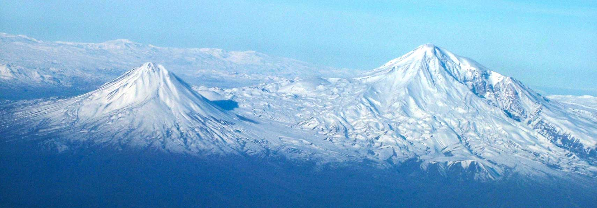

# Çiyayên Kurdistanê (Kurdistan Mountains)

###### Image source: [Nations Online](https://www.nationsonline.org/oneworld/map/Mount_Ararat.htm)

[Central Kurdish](#پێشەکی) | [Kurmancî](#destpêk) | [English](#Introduction)

---

## Introduction

We have a lot of mountains in Kurdistan. Some of them are very famous and some of them are not. In this project, we are going to collect information about all of them. We will use this information for various purposes.

## Contribute to this project

We need local people to help us with this project. If you are a local person and you know about the mountains in your area, please help us to collect information about them. You can use the following table to add information about the mountains in your area. If you don't know how to use this table, please contact us.

---

## پێشەکی

ئێمە لە کوردستان شاخ و کێوی زۆرمان هەیە. هەندێکیان زۆر بەناوبانگن و هەندێکیشیان بەناوبانگ نین. لەو پڕۆژەیەدا بڕیارە زانیاری لەسەر هەموویان کۆبکەینەوە. ئەم زانیاریانە بۆ مەبەستی جیاواز کۆ دەکرێنەوە.

## بەشداری لەم پڕۆژەیەدا بکەن

پێویستمان بە خەڵکی خۆماڵی و تایبەت بە ناوچەکان هەیە کە هاوکارمان بن لەم پڕۆژەیەدا. ئەگەر کەسێکی ناوخۆییت و زانیاریت لەسەر شاخەکانی ناوچەکەت هەیە، تکایە هاوکاریمان بکە بۆ کۆکردنەوەی زانیاری لەسەریان. دەتوانیت ئەم خشتەیەی خوارەوە بەکاربهێنیت بۆ زیادکردنی زانیاری لەسەر شاخەکانی ناوچەکەت. ئەگەر نازانیت چۆن ئەم خشتەیە بەکاربهێنیت پەیوەندیمان پێوە بکە.

---

## Destpêk

Li Kurdistanê gelek çiyayên me hene. Hin ji wan pir navdar in û hin ji wan ne. Di vê projeyê de, em ê li ser hemî wan agahdarî kom bikin. Em ê bi van agahiyan ji bo armancên cuda bi kar tînin.

## Di vê projeyê de beşdar bibin

Pêwîstiya me bi gelê herêmê heye ku di vê projeyê de alîkariya me bikin. Ger tu mirovekî xwecihî yî û bi çiyayan li herêma xwe dizanî, ji kerema xwe alîkariya me bike ku em li ser wan agahiyan berhev bikin. Hûn dikarin tabloya jêrîn bikar bînin da ku agahdariya li ser çiyayên li herêma xwe zêde bikin. Heke hûn nizanin ka meriv çawa vê tabloyê bikar tîne, ji kerema xwe bi me re têkilî daynin.

---

## Kurdistan Mountains Table

### Verified Mountains Table

| ckb_name | kmr_name | Height | Chain_ckb | Chain_kmr | coordinates | verified_by | verified_on |
| -------- | -------- | ------ | --------- | --------- | ----------- | ----------- | ----------- |

---

### Unverified Mountains Table

Avoid depending on this table without thorough verification, as the data may not be reliable.

ئەو خشتەیەی خوارەوە هەر وەکوو پێشنووسێک ئامادە کراوە و پڕە لە هەڵە. تکایە بۆ هیچ مەبەستێک نابێت پشتی پێ ببەسترێت.

| ckb_name            | kmr_name           | Height | Chain_ckb | Chain_kmr | city_kmr                | Herêm                                  |
| ------------------- | ------------------ | ------ | --------- | --------- | ----------------------- | -------------------------------------- |
| هەڵگورد             | Hallgord           | 3607   |           |           |                         |                                        |
| چیخی دەرێ           | Çîxî Derê          | 3611   |           |           | Hawler-Piranshar        |                                        |
| تەرەغە              | Taragha            | 2222   |           |           |                         |                                        |
| ئاویەر              | Abidar             | 2550   |           |           |                         |                                        |
| بۆتین               | Butin              | 2534   |           |           |                         |                                        |
| ئاربابا             | Arbaba             | 2180   |           |           |                         |                                        |
| حاجی ئیبراهیم       | Haji Ebrahim       | 3587   |           | Qandil    | Iran-Iraq               |                                        |
| کۆرەک               | Korek              | 2127   |           |           | Hawler - Rawandz        |                                        |
| قەندیل              | Qandil             | 3587   |           |           |                         |                                        |
| ئەزمەڕ              | Azmar              | 1702   |           |           |                         |                                        |
| گۆڕەز               | Goraz              | 2058   | قەندیل    | Qandil    |                         |                                        |
| ئارارات             | Agirî(Ararat)      | 5137   |           |           |                         | Bakurê Kurdistanê                      |
| سیپان               | Sipan              | 4058   |           |           |                         |                                        |
| چێل مێرا            | Chil Mera          | 1463   | شنگال     | Sinjar    |                         |                                        |
| کوردان              | Kurdan             | 1269   |           |           | Afrin                   |                                        |
| کەو کەز             | Kawkaz             | 3800   | قەندیل    | Qandil    |                         |                                        |
| زەردکێو             | Zerdkew            | 1600   | زاگرۆس    | Zagros    | Luristan                |                                        |
|                     | Dena (Qash-Mastan) | 4409   | زاگرۆس    | Zagros    |                         |                                        |
| کەبیر               | Kebir              | 2790   | زاگرۆس    | Zagros    | Ilam                    |                                        |
| ھەندرێن             | Hendren            | 2625   |           |           | Hawler                  |                                        |
| قەڵاتە              | Qelate             | 1953   |           |           | Piranshar - Mirawa      |                                        |
| سەفین               | Sefin              | 1828   |           |           | Hawler - Shaqlawa       |                                        |
| گۆمی بێکۆدیان       | Gomi Bekodyan      | 3150   |           |           | Hawler - Choman         |                                        |
| کارۆخ               | Karox              | 2659   |           |           | Hawler - Werte          |                                        |
| پیرەمەگروون         | Piremegrun         | 2611   |           |           | Slemani - Pira Magrun   |                                        |
| سورێن               | Suren              | 2490   |           |           | Slemani - Sayd Sadiq    |                                        |
| گمۆ                 | Gimo               | 2391   |           |           | Slemani - Sharbajer     |                                        |
| بەفرەسوران          | Befresuran         | 2266   |           |           | Slemani - Sharbajer     |                                        |
| کوڕەکاژاو           | Kurekajaw          | 2225   |           |           | Slemani - Sharbajer     |                                        |
| ژیلوان              | Jilwan             | 2181   |           |           | Slemani - Doli Jafayati |                                        |
| هەوارە بەرزە        | Heware Berze       | 2160   |           |           | Halabja                 |                                        |
| چایەر               | Chayer             | 2108   |           |           | Slemani - Pira Magrun   |                                        |
| قەڵاسارم            | Qelasarm           | 2052   |           |           | Slemani - Sharbajer     |                                        |
| شنروێ               | Shinirwe           | 2045   |           |           | Halabja                 |                                        |
| ئاسنگەران           | Asingeran          | 1860   |           |           | Slemani - Doli Jafayati |                                        |
| پیربایز             | Pirbayiz           | 1743   |           |           |                         |                                        |
| ڕەشکۆ               | Reşko              | 4135   |           |           | Colemêrg                | Bakurê Kurdistanê                      |
| جیلۆ                | Cîlo               | 4116   |           |           | Colemêrg                | Bakurê Kurdistanê                      |
| سیپانێ خەلاتێ       | Sîpanê Xelatê      | 4058   |           |           | Bedlîs                  | Bakurê Kurdistanê                      |
| چیخی دەرێ           | Çîxî Derê          | 3611   |           |           |                         | Başûrê Kurdistanê/Rojhilatê Kurdistanê |
| قەندیل              | Qendîl             | 3587   |           |           |                         | Başûrê Kurdistanê/Rojhilatê Kurdistanê |
| چیایێ تەندوورەک     | Çiyayê Tendûrek    | 3533   |           |           | Agirî                   | Bakurê Kurdistanê                      |
| ئاگرییێ بچووک       | Agiriyê Biçûk      | 3896   |           |           | Agirî                   | Bakurê Kurdistanê                      |
| مەرجان              | Mercan             | 3549   |           |           | Erzincan                | Bakurê Kurdistanê                      |
| ئاکبابا             | Akbaba             | 3463   |           |           | Erzincan                | Bakurê Kurdistanê                      |
| کۆسەداخ             | Kosedax            | 3340   |           |           | Zêdikan                 | Bakurê Kurdistanê                      |
| پالتۆکان            | Paltokan           | 3271   |           |           | Erzirom                 | Bakurê Kurdistanê                      |
| نورهاک              | Nurhak             | 3081   |           |           | Mereş                   | Bakurê Kurdistanê                      |
| قاش مستارا          | Qaş Mistara        | 4460   |           |           |                         |                                        |
| دینار               | Dînar              | 4409   |           |           |                         |                                        |
| قەندیل              | Qendîl             | 4356   |           |           |                         |                                        |
| کیلونچی             | Kilunçî            | 4225   |           |           |                         |                                        |
| زەردەکێو            | Zerdekuh           | 4221   |           |           |                         |                                        |
| ئۆشترانکێو          | Oştirankuh         | 4150   |           |           |                         |                                        |
| شا شەهیدان          | Şah Şehîdan        | 4150   |           |           |                         |                                        |
| ڕەشکۆ               | Reşko              | 4135   |           |           |                         |                                        |
| جیلۆ                | Cîlo               | 4116   |           |           |                         |                                        |
| گازینستان           | Gazînistan         | 4082   |           |           |                         |                                        |
| سیپانێ خەلاتێ       | Sîpanê Xelatê      | 4058   |           |           |                         |                                        |
| بن ڕوو              | Bin Rû             | 4000   |           |           |                         |                                        |
| پینبەگال            | Pinbegall          | 4000   |           |           |                         |                                        |
| هەفت چەشمە          | Heft Çeşme         | 3972   |           |           |                         |                                        |
| گرەهـ               | Gerrih             | 3950   |           |           |                         |                                        |
| چهل خشت             | Çihil Xişt         | 3950   |           |           |                         |                                        |
| هەشتاد              | Heştad             | 3906   |           |           |                         |                                        |
| میلی                | Mîlî               | 3903   |           |           |                         |                                        |
| قالی کێو            | Qalî Kuh           | 3901   |           |           |                         |                                        |
| ئاگرییێ بچووک       | Agiriya Biçûk      | 3896   |           |           |                         |                                        |
| ئۆرتا               | Orta               | 3866   |           |           |                         |                                        |
| هەزار دەرە          | Hezar Derrih       | 3862   |           |           |                         |                                        |
| کەلار               | Kelar              | 3832   |           |           |                         |                                        |
| مۆر مۆر             | Mor Morr           | 3807   |           |           |                         |                                        |
| قادی کێو            | Qadîkuh            | 3800   |           |           |                         |                                        |
| وەنگ                | Weng               | 3800   |           |           |                         |                                        |
| هەرا                | Herra              | 3800   |           |           |                         |                                        |
| سات                 | Sat                | 3794   |           |           |                         |                                        |
| قەرەداخ             | Qeredax            | 3752   |           |           |                         |                                        |
| بەلیش               | Belîş              | 3750   |           |           |                         |                                        |
| هەساری رۆستێ        | Hesarî Rostê       | 3727   |           |           |                         |                                        |
| میر                 | Mîr                | 3724   |           |           |                         |                                        |
| سوڵتان ئەقزەتوو     | Siltan Eqzetû      | 3720   |           |           |                         |                                        |
| شێخ هەمزە           | Şêx Hemze          | 3710   |           |           |                         |                                        |
| مینار               | Minar              | 3701   |           |           |                         |                                        |
| باشەق               | Başeq              | 3684   |           |           |                         |                                        |
| خوردە               | Xurde              | 3676   |           |           |                         |                                        |
| ئەسپیریز            | Espîrîz            | 3668   |           |           |                         |                                        |
| ڕیگ                 | Rîg                | 3661   |           |           |                         |                                        |
| تەندوورەک           | Tendûrek           | 3660   |           |           |                         |                                        |
| ئەورینی مەزن        | Ewrînî Mezin       | 3650   |           |           |                         |                                        |
| گەرین               | Gerîn              | 3645   |           |           |                         |                                        |
| چوروو               | Çurrû              | 3635   |           |           |                         |                                        |
| بەختیار شەهاب       | Bextiyar Şehab     | 3634   |           |           |                         |                                        |
| زەراب               | Zerab              | 3625   |           |           |                         |                                        |
| ساڵدارون            | Salldarrun         | 3621   |           |           |                         |                                        |
| بەردەسپی            | Berdespî           | 3620   |           |           |                         |                                        |
| مونگەشت             | Mungeşt            | 3613   |           |           |                         |                                        |
| بەردەڕەش            | Berdereş           | 3608   |           |           |                         |                                        |
| دەرەڕەش             | Derereş            | 3608   |           |           |                         |                                        |
| سومبول              | Sumbul             | 3607   |           |           |                         |                                        |
| هەڵگورد             | Hellgurd           | 3607   |           |           |                         |                                        |
| میشپەروەر           | Mîşperwer          | 3606   |           |           |                         |                                        |
| ئەگور               | Egur               | 3596   |           |           |                         |                                        |
| شەهیدان             | Şehîdan            | 3579   |           |           |                         |                                        |
| سیاکێو              | Siyahkuh           | 3578   |           |           |                         |                                        |
| میواریت باش ئاڵاداخ | Miwarit Baş Aladax | 3510   |           |           |                         |                                        |
| ئەحمەد دلێرە        | Ehmed Dilêre       | 3550   |           |           |                         |                                        |
| کەشیش               | Keşîş              | 3549   |           |           |                         |                                        |
| ئارتۆشت چادیر       | Artoşt Çadîr       | 3537   |           |           |                         |                                        |
| ئارناس قەچیچە       | Arnas Qeçiçe       | 3537   |           |           |                         |                                        |
| چاڵکەڵاخ            | Çallkellax         | 3531   |           |           |                         |                                        |
| سەبزکێو             | Sebizkû            | 3527   |           |           |                         |                                        |
| بوزمەرگسیر          | Buzmergsîr         | 3520   |           |           |                         |                                        |
| تەمەندەر            | Temender           | 3520   |           |           |                         |                                        |
| لیس                 | Lîs                | 3520   |           |           |                         |                                        |
| ورلاگەدیخی          | Wirrlagedîxî       | 3515   |           |           |                         |                                        |
| کیکی نوو            | Kîkî Nû            | 3512   |           |           |                         |                                        |
| سەرێ مراد ئاڵداخ    | Serê Mirad Aladax  | 3510   |           |           |                         |                                        |
| خەزەب               | Xezeb              | 3505   |           |           |                         |                                        |
| حەسۆ بەشیر          | Heso Beşîr         | 3503   |           |           |                         |                                        |
| داڵان               | Dallan             | 3492   |           |           |                         |                                        |
| هەرەویلداخی         | Herewîldaxî        | 3488   |           |           |                         |                                        |
| هەراوی یایخیت       | Herawîl Yayxît     | 3486   |           |           |                         |                                        |
| بۆزی سینا           | Bozî Sîna          | 3480   |           |           |                         |                                        |
| لەچەن               | Leçen              | 3479   |           |           |                         |                                        |
| بەرەیەزدهـ          | Bereyezdih         | 3479   |           |           |                         |                                        |
| قەندیل              | Qendîl             | 3468   |           |           |                         |                                        |
| گارە قەرەداخ        | Gare Qeredax       | 3460   |           |           |                         |                                        |
| مافارون             | Mafarun            | 3459   |           |           |                         |                                        |
| قارلی               | Qarlî              | 3453   |           |           |                         |                                        |
| دەڕیهدان            | Derrihdan          | 3450   |           |           |                         |                                        |
| سیاکێو              | Siyahkuh           | 3450   |           |           |                         |                                        |
| کۆسەی مەزن          | Kosey Mezin        | 3433   |           |           |                         |                                        |
| مەرە                | Mere               | 3421   |           |           |                         |                                        |
| ئەورینی بچووک       | Ewrînî Biçûk       | 3417   |           |           |                         |                                        |
| نیل                 | Nîl                | 3415   |           |           |                         |                                        |
| میکەلە جاسووس موکوس | Mîkele Casûs Mukus | 3414   |           |           |                         |                                        |
| مەنگەنە             | Mengene            | 3412   |           |           |                         |                                        |
| دالانک              | Dalanik            | 3402   |           |           |                         |                                        |
| سوختیهـ             | Suxtih             | 3400   |           |           |                         |                                        |
| داڵامپڕ             | Dalampirrs         | 3400   |           |           |                         |                                        |
| مەسناباد            | Mesnabad           | 3395   |           |           |                         |                                        |
| سات سامدی           | Sat Samdî          | 3394   |           |           |                         |                                        |
| شاهۆ                | Şaho               | 3390   |           |           |                         |                                        |
| کۆسەداخ             | Kosedax            | 3453   |           |           |                         |                                        |
| پەڕۆ                | Perro              | 3357   |           |           |                         |                                        |
| پالتۆکان            | Paltokan           | 3271   |           |           |                         |                                        |
| ئایدین              | Aydin              | 2973   |           |           |                         |                                        |
| شەوانت              | Şewant             | 2970   |           |           |                         |                                        |
| نەمروود             | Nemrûd             | 2948   |           |           |                         |                                        |
| چوتەلە ئاقچەقەرە    | Çutele Aqçeqere    | 2940   |           |           |                         |                                        |
| کومانا هاسان        | Kumana Hasan       | 2927   |           |           |                         |                                        |
| شایان               | Şaytan             | 2913   |           |           |                         |                                        |
| کاڤاکی تۆسیک        | Kavakî Tosîk       | 2904   |           |           |                         |                                        |
| زیارەت              | Ziyaret            | 2887   |           |           |                         |                                        |
| شەقشەق              | Şeqşeq             | 2858   |           |           |                         |                                        |
| کەبیر کێو           | Kebîrkuh           | 2790   |           |           |                         |                                        |
| کونەکۆتر            | Kunekotir          | 2692   |           |           |                         |                                        |
| پیرەمەگروون         | Pîremegrûn         | 2620   |           |           |                         |                                        |
| کارووخ              | Karûx              | 2560   |           |           |                         |                                        |
| بوتین               | Butîn              | 2534   |           |           |                         |                                        |
| مانشت               | Manişt             | 2429   |           |           |                         |                                        |
| کارەر               | Karer              | 2373   |           |           |                         |                                        |
| چاڤرەش              | Çavreş             | 2246   |           |           |                         |                                        |
| جوودی               | Cûdî               | 2114   |           |           |                         |                                        |
| قەرەژداخ            | Qerejdax           | 1928   |           |           |                         |                                        |
| زۆزگ                | Zozig              | 1829   |           |           |                         |                                        |
| باگۆک               | Bagok              | 1210   |           |           |                         |                                        |
| بەمۆ                | Bemo               | 1828   |           |           |                         |                                        |
| داڵاهۆ              | Dallaho            | 1810   |           |           |                         |                                        |
| کوهدرە              | Kuhdira            | 1806   |           |           |                         |                                        |
| ئەزمەڕ              | Ezmerr             | 1702   |           |           |                         |                                        |
| گۆیژە               | Goyijê             | 1524   |           |           |                         |                                        |
| قەرەقاش             | Qereqaş Sovdax     | 1496   |           |           |                         |                                        |
| ڕامان               | Raman              | 1260   |           |           |                         |                                        |
| لەوەند              | Lewend             | 970    |           |           |                         |                                        |
| تاسڵووجە            | Tasluce            | 911    |           |           |                         |                                        |
| یانارسوو گارزان     | Yanarsû Garzan     | 865    |           |           |                         |                                        |
| ئارات               | Arat               | 840    |           |           |                         |                                        |
| سووسوو              | Sûsû               | 801    |           |           |                         |                                        |
| تەقتەق              | Teqteq             | 749    |           |           |                         |                                        |
| کوهزیززەردی         | Kuhzîrzerdî        | 750    |           |           |                         |                                        |
| لیراک               | Lîrak              | 646    |           |           |                         |                                        |
| چیایێ ئەڤدلەزیزە    | Çiyayê Evdilezîzê  |        |           |           |                         |                                        |
| چیایێ کورمێنج       | Çiyayê Kurmênc     |        |           |           |                         |                                        |
| چیایێ مونزور        | Çiyayên Munzur     |        |           |           |                         |                                        |
| چیایێ شنگالێ        | Çiyayê Şingalê     |        |           |           |                         |                                        |
| تۆرۆس               | Toros              |        |           |           |                         |                                        |
| زاگرۆس              | Zagros             |        |           |           |                         |

---

## License

This project is licensed under the GNU General Public License v3.0 - see the [LICENSE](LICENSE) file for details
